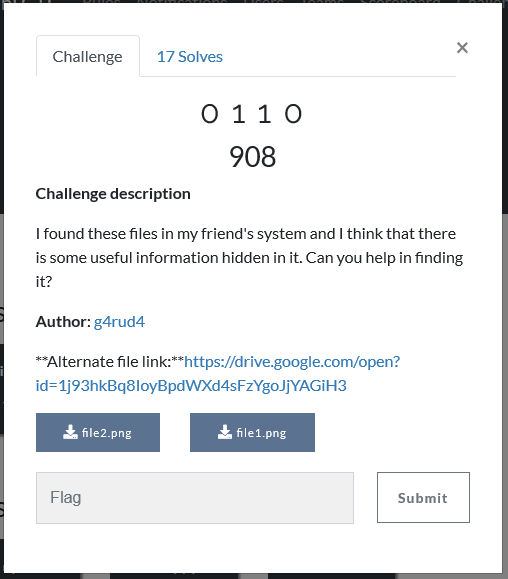
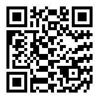
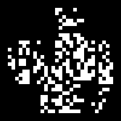
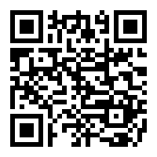

# 0110
Points: 908

## Category
Forensics

## Question
>Challenge description
I found these files in my friend's system and I think that there is some useful information hidden in it. Can you help in finding it?
Author: g4rud4
**Alternate file link:** [link](https://drive.google.com/open?id=1j93hkBq8IoyBpdWXd4sFzYgoJjYAGiH3)

### Hint
> disediakan 2 File2 file

## Solution
1. Disediakan 2 buah file png

2. Ketika ada 2 file kemungkinan besar kita harus melakukan perbandingan
3. Lakukan **Image Combiner** dengan menggunakan *stegsolve* ketika image di XOR didapatkan barcode yang sepertinya bagus.

4. Lakukan Decode Barcode tersebut didapatkan flag string

### Flag
`bsides_delhi{X0r1ng_tw0_f1l3s_g1v3s_7h3_r3sul7}`
