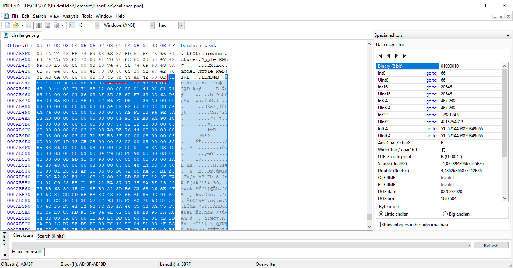

# Business Planning Group
Points: 676 pts

## Category
Forensics

## Question
>Challenge description
My opponents have planned to destroy my business. They are stealing my business secrets with the help of a spy by storing them in the images. I have found one such image. I hope you can find the secret.
Alternate Link link
Author: sh4d0w

### Hint
> Gak ada hint

## Solution
1. Disediakan gambar challenge.png

2. Analisa menggunakan beberapa forensic solve
3. Setelah dilakukan `zsteg challenge.png`
4. Didapatkan hasil seperti berikut

5. Perhatikan bagian yang ditanda biru, disitu terlihat bahwa ada beberapa data tambahan yang ditambahkan di belakang file PNG tersebut
6. Pisahkan data tersebut dari file PNG dengan menggunakan **Hex Editor** 
>FYI file PNG diakhiri dengan IEND dan hex 82

7. Didapatkan file BPG, ketika di search google didapatkan [BPGViewer](https://bpgviewer.sourceforge.net/)
8. Didapatkan gambar dengan string base64 pada gambar tersebut **YnNpZGVzX2RlbGhpe0JQR19pNV9iM3R0M3JfN2g0bl9KUEd9C9==**
9.Setelah didecode didapatkan flag

### Flag
`bsides_delhi{BPG_i5_b3tt3r_7h4n_JPG}`
