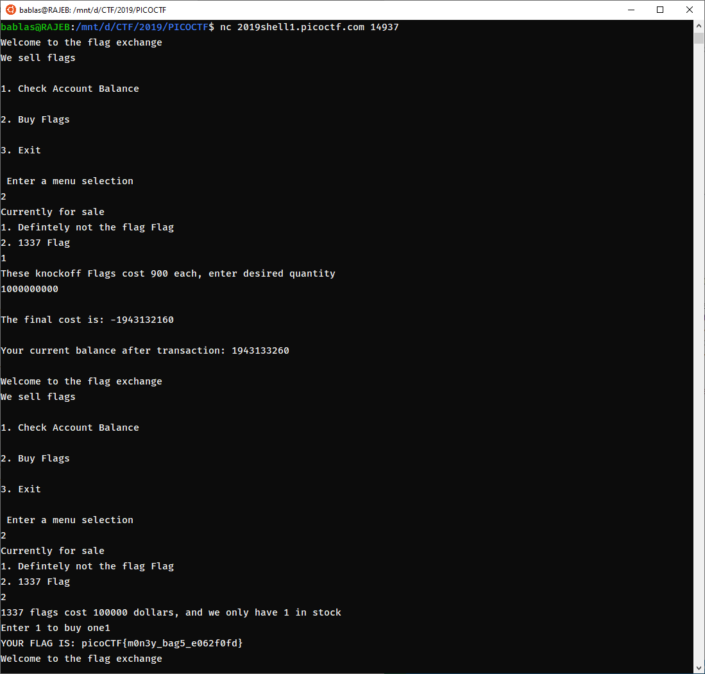

# FLAG-SHOP
Points: 300 pts

## Category
General Skill

## Question
>There's a flag shop selling stuff, can you buy a flag? [Source](./store.c). Connect with nc 2019shell1.picoctf.com 14937

### Hint
>Two's compliment can do some weird things when numbers get really big!

## Solution

1. Disediakan saldo 1100 untuk membeli flag pada kategory 2
2. Lakukan pembelian flag pada flag 1 dengan membeli 1000000000 flag yaitu digunanakan untuk emebufer nilai dari dari total cost sehingga didapatkan total cost menjadi negatif karena dia hanya menerima int. sedangkan int hanya sampai 8 digit.
3. kemudian lakukan pembelian pada flag kedua.
4. maka akan didapatkan flagnya

### Flag
`picoCTF{m0n3y_bag5_e062f0fd}`
